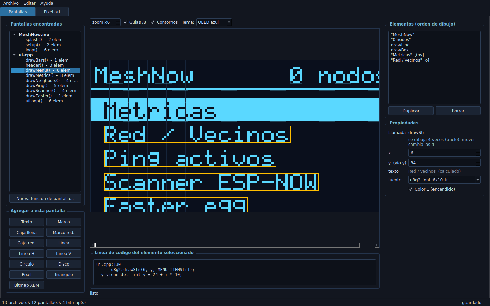

# u8g2 Studio

Editor visual de interfaces para displays monocromáticos. Local, open source, y
**edita el código que ya tienes** en vez de generar código nuevo para que lo pegues.

Abres la carpeta de tu sketch — **cualquier proyecto que use u8g2, U8x8 o
Adafruit_GFX**, no uno en particular — la app interpreta las funciones que
dibujan, te las muestra, y cuando arrastras algo reescribe el número exacto
dentro de la llamada. No hay archivo de proyecto ni base de datos: **el
código es el modelo**.



---

## Lo que lo hace distinto

Herramientas como Lopaka te dan un canvas y escupen código para copiar. El problema
es la vuelta: si ya tienes 300 líneas de `ui.cpp` funcionando, no puedes cargarlas
de vuelta al canvas. Esto sí.

```
                       lee y reescribe
  ui.cpp  ──────────────────────────────────────►  canvas
     ▲                                                │
     └────────────  Ctrl+S  ◄─────────────────────────┘
```

Arrastras un texto 3 px a la derecha y en el archivo pasa esto, y nada más que esto:

```diff
- u8g2.drawStr(2, 9, "Hola");
+ u8g2.drawStr(5, 9, "Hola");
```

No asume nada de tu proyecto: detecta el nombre de tu objeto de display
(`u8g2`, `display`, `oled`, el que sea) leyendo cómo lo llamas, y detecta la
resolución real de la pantalla leyendo el constructor (`U8G2_..._128X64_...`,
`U8G2_..._128X32_...`, lo que declares), con `#define SCREEN_W/SCREEN_H` (o
variantes comunes como `OLED_WIDTH`) como respaldo.

---

## Qué entiende de tu código

No hace pattern-matching sobre líneas: hay un intérprete de un subconjunto de C
que ejecuta la función y va anotando de qué tramo del archivo salió cada argumento.

**Resuelve el estado del display.** `setFont()` y `setDrawColor()` se siguen a lo
largo de la función, así que cada texto se dibuja con su fuente real y un item
resaltado (en negativo, por ejemplo) se ve como se va a ver.

**Desenrolla bucles.** Un `for (i = 0; i < N; i++)` con `N` resoluble
dibuja los N items. El elemento aparece marcado como *se dibuja N veces*, y moverlo
mueve todos porque cambia la constante de la expresión.

**Sigue variables hasta su origen.** Si el código dice `drawStr(6, y, ...)` y más
arriba `int y = 24 + i * 10;`, la app edita la asignación:

```diff
- int y = 24 + i * 10;
+ int y = 26 + i * 10;
```

Y si otra llamada usa la misma variable, se mueve sola con el grupo. El panel
lo indica con `y (via y)`.

**Respeta las expresiones.** `drawStr(SCREEN_W - w - 2, 9, sub)` se mueve ajustando
el término correcto, y si cruza el cero voltea el operador:

```diff
- u8g2.drawStr(SCREEN_W - w - 2, 9, sub);
+ u8g2.drawStr(SCREEN_W - w + 1, 9, sub);
```

**Calcula `getStrWidth()` de verdad**, con las métricas reales de la fuente, así que
el texto alineado a la derecha cae donde va a caer en el display.

**Resuelve `snprintf`.** `snprintf(l, sizeof(l), "TX:%lu  RX:%lu", tx, rx)` se
renderiza con valores de muestra (`TX:128  RX:96`), respetando la precisión del
formato (`%.1f` da un decimal, no dos), para que veas el ancho real de la línea.
Editar ese texto en el panel cambia la cadena de formato.

**Inlinea tus funciones.** Si `pantallaX()` llama a un helper compartido
(`header("Titulo")`), sus elementos aparecen dentro de la pantalla, con contorno
morado punteado para avisar que viven en otra función. Moverlos los mueve en
todas las pantallas que llaman a ese helper — la app lo dice antes de dejarte
borrarlos.

**Sabe cuándo no puede.** Un argumento sin ningún literal que tocar sale marcado
`[fijo]` y no se arrastra. Prefiere no tocar nada antes que inventar una edición
que cambie la lógica. Un `switch` con selector desconocido no ejecuta ninguna
rama, y las funciones de librería que no conoce devuelven un valor de muestra.

### Lo que no hace

Los glifos se dibujan con una fuente 5×7 escalada al alto real de la fuente
u8g2: **la posición y el espacio que ocupa el texto son fieles, el trazo es
aproximado** (exacto para las monoespaciadas, aproximado para `ncenB*` y `helv*`).

---

## Las dos pestañas

### Pantallas

Árbol con cada función que produce dibujo, agrupada por archivo. Seleccionas una,
la ves renderizada, y editas:

- Arrastrar mueve. El cuadrito naranja redimensiona. Flechas = 1 px, Shift = 5.
- Panel de propiedades con x, y, w, h, r, texto, fuente y color por elemento.
- Agregar elementos (texto, marco, caja, redondeados, líneas, círculo, disco, píxel,
  triángulo, bitmap XBM) — se insertan como una línea nueva al final de la función.
- Duplicar y borrar operan sobre la línea de código.
- Abajo se ve la línea exacta del archivo y, si aplica, de dónde sale la variable.

### Pixel art

Un Paint de 1 bit sobre los arreglos de bytes del proyecto. El combo lista todos los
que encontró en la carpeta (incluidas hojas de sprites 2D, frame por frame).

Lápiz, borrador, línea, rectángulo y elipse (huecos y llenos), relleno por
inundación, texto, selección con copiar/cortar/pegar, cuentagotas. Izquierdo pinta,
derecho borra. Invertir, espejo, desplazar, redimensionar el lienzo. Importar
PNG/JPG con umbral en vivo o dithering Floyd-Steinberg. Exportar PNG.

El bitmap se escribe de vuelta reemplazando **solo los bytes** del arreglo:
comentarios, `#pragma once` y `#define` quedan intactos, y los `_W`/`_H` se
actualizan si cambias el tamaño.

---

## Guardado

Nada toca el disco hasta **Ctrl+S**. El título lleva un asterisco y la barra de
estado dice qué archivos están pendientes. Al cerrar te pregunta.

**No se crean archivos `.bak`.** La red de seguridad es git (o el control de
versiones que uses) más el Ctrl+Z de la app, que deshace sobre el texto del archivo.

Si editas los mismos archivos por fuera (otro editor, git checkout), la app lo
detecta y ofrece releer del disco.

---

## Instalación y uso

```bash
pip install PyQt5 Pillow          # Pillow es opcional, solo para imágenes
python u8g2_studio.py             # abre un selector de carpeta
python u8g2_studio.py ruta/a/tu/sketch
```

En Windows, `run.bat` hace lo mismo (`run.bat` a secas, o `run.bat ruta`). Si
`python` no está en el PATH, usa `py`. La app recuerda la última carpeta que
abriste.

## Atajos

| Tecla | Acción |
|---|---|
| `Ctrl+O` / `Ctrl+S` | abrir carpeta / guardar |
| `Ctrl+Z` / `Ctrl+Y` | deshacer / rehacer |
| Flechas | mover 1 px (`Shift` = 5) |
| `Ctrl` + rueda | zoom |
| `Supr` | borrar la selección (pixel art) |
| `P E L R F O D B T S I` | herramientas del pixel art |
| `Ctrl+I` | importar imagen |

---

## Estructura

```
u8g2Studio/
  u8g2_studio.py      ventana, menús, guardado
  ms_cparse.py         tokenizer + parser + intérprete del subconjunto de C
  ms_project.py        carpeta -> pantallas y bitmaps; parches sobre el texto
  ms_designer.py       pestaña de pantallas (render, arrastre, propiedades)
  ms_editor.py         pestaña de pixel art
  ms_core.py           Bitmap 1-bit, arreglos C, import/export de imágenes
  ms_fonts.py          fuente 5x7 + métricas reales de las fuentes u8g2
  test_project.py      pruebas de extremo a extremo contra un sketch real
```

```bash
QT_QPA_PLATFORM=offscreen python test_project.py
```

Copia el sketch de prueba a una carpeta temporal antes de tocarlo, así que
nunca modifica tus archivos originales. Verifica, entre otras cosas, que tras
editar todos los elementos de una pantalla el archivo conserve el mismo
número de líneas, llaves, `;` y comentarios, y que se siga analizando igual
— y valida por separado que la detección de objeto de display, resolución de
pantalla y `snprintf` funcionen igual en un proyecto sin relación con el
original con el que se construyó la herramienta.

---

## Licencia

MIT.
